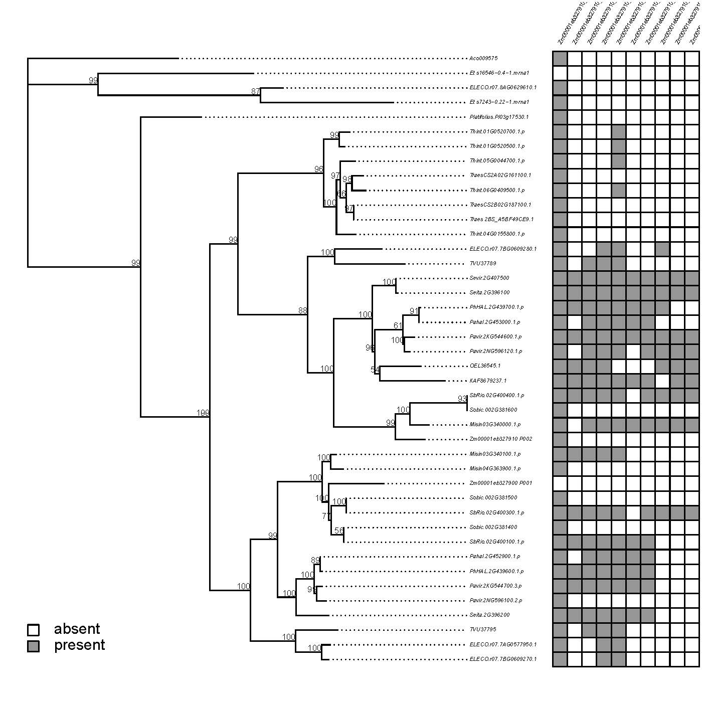

## CNS Tree Analysis: Map conserved non-coding regions onto gene trees
This nextflow pipeline builds a gene tree using the conservatory proteins database and maps all conserved CNS regions onto the tree for your gene of interest. 

### To Run (on MGHPCC): 
`bsub -q long -o nextflow_job.out -e nextflow_job.err -W 30:00 "sh nextflow.sh <pathToFasta> <outgroup> <ref_gene>"` 

Submit the nextflow.sh script to the cluster with three required arguments, (1) the path of your fasta with the starting protein sequences, (2) the name of your outgroup gene ID, as annotated in the conservatory protein database, and (3) your reference gene ID, as annotated in the conservatory protein database. This is the gene you want to check for CNSs.

The fasta file has protein sequences from your gene family. You should use at least 5 protein sequences, but more is better. The sequences should be well-sampled across species at the scale you are interested in. One of the sequences must be from an outgroup. The gene IDs in the fasta don't matter, as just the sequences will be used to build the HMM.
The gene IDs of your outgroup gene and reference gene should match the conservatory protein database.

To check the progress of the pipeline, view the log using `cat nextflow_job.out` .

### Optional arguments:

`bsub -q long -o nextflow_job.out -e nextflow_job.err -W 30:00 "sh nextflow.sh <pathToFasta> <outgroup> <ref_gene> <options>"`

Resume your previous run if it was interrupted (default false)  `-r true`  
Don't search for new genes, just use input fasta as the tree genes (default false) `-n true`   
Output a colorful final graph instead of the default black and white (default false) `-c true`  

example:  `bsub -q long -o nextflow_job.out -e nextflow_job.err -W 30:00 "sh nextflow.sh ./myfasta.fa Aco0001234 Zm000eb1234 -r true -n true -c true"`

### How it works:
Steps:
1) Two rounds of hidden markov model generation and search for homologous genes, using an outgroup gene you provide as the cut-off (uses HMMer, MAFFT, samtools). 
2) Build a gene tree (uses RAXML-ng).
3) Search the Family.bam file generated from conservatory, and extract all CNS regions in orthologous genes that overlap the reference gene CNS regions. Generates a table. (uses python-pandas, samtools)
4) Map the generated cns table values onto the gene tree and output a pdf. (uses R-phytools)

### Installation:
This pipeline is set up to work on the MGHPCC cluster, which has preinstalled modules for most of the programs. The only exception is R-phytools, which runs using its own conda environment.
If the R-phytools conda environment (phytoolsConda) is not already present in the cns-tree-analysis folder, there is code you can uncomment in nextflow.sh that will create the enviornment for you. This only needs to be done once.

If you are not using the MGHPCC cluster, you will have to modify a few things to get the pipeline to work.
1) Modify each process in cns_tree_generation.nf to match your cluster scheduler, it is currently set for lsf. ( [see nextflow documentation for more info](https://www.nextflow.io/docs/latest/executor.html#) )
2) Remove all "module load" lines, and instead for each process load an anaconda enviornment with the following programs:
- MAFFT
- HMMer
- Samtools
- RAXML-ng
- python3
- python3-pandas
- R
- R-phytools
- R-codetools
- R-colorbrewer
- Unix tools used : dos2unix, grep, awk, sed

### Troubleshooting cropped graphs:
If you are plotting many CNS regions, the output graph will not fit on the pdf output. I havn't found a way to fix this yet in R, but you can get around it in Adobe Illustator.
1) Open your pdf in Illustator.
2) Select the edge of the whitespace, right click, and select 'release clipping mask'. The full graph will now be visible.
3) On the top menu bar, go to Object -> Artboards -> Fit to Artboard Bounds. The whitespace will expand to fit the full graph.
4) Export
